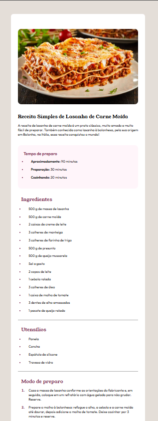

# Receita Simples de Lasanha de Carne Moída

Este projeto apresenta uma página web responsiva que detalha uma receita clássica de lasanha de carne moída, incluindo ingredientes, utensílios necessários e o modo de preparo. Ele foi desenvolvido como parte de um desafio no [Frontend Mentor](https://www.frontendmentor.io/).

## Visualização


> Foto de um pedaço de lasanha em um prato branco, pronto para ser servido.

## Tecnologias Utilizadas

- **HTML5:** Estrutura semântica do site.
- **CSS3:** Estilização e responsividade.
- **Google Fonts:** Fontes customizadas (Inter, Outfit, Young Serif).

## Funcionalidades

- **Layout Responsivo:** Ajusta-se para diferentes tamanhos de tela, incluindo celulares e tablets.
- **Apresentação Clara:** Estrutura dividida em seções para ingredientes, utensílios e modo de preparo.
- **Estilo Simples e Atraente:** Uso de cores neutras e fontes legíveis.

## Estrutura do Projeto

```plaintext
Projeto/
├── assets/
│   ├── images/
│   │   └── lasanha.jpg
├── css/
│   └── style.css
├── index.html
└── README.md
```

## Como Executar

1. Clone o repositório:
   ```bash
   git clone https://github.com/Jotta-Sant/receita-lasanha.git
   ```
2. Navegue até a pasta do projeto:
   ```bash
   cd receita-lasanha
   ```
3. Abra o arquivo `index.html` no navegador.

## Detalhes da Receita

### Ingredientes Principais
- Massa de lasanha
- Carne moída
- Molho de tomate
- Queijo mussarela
- Presunto
- Outros ingredientes descritos no site.

### Tempo de Preparo
- Aproximadamente 90 minutos (incluindo preparação e cozimento).

### Utensílios Necessários
- Panela
- Concha
- Espátula de silicone
- Travessa de vidro

## Inspiração
Este projeto foi inspirado por um desafio do [Frontend Mentor](https://www.frontendmentor.io?ref=challenge). 

Coded by [Jailton Santana](https://github.com/Jotta-Sant).

## Melhorias Futuras

- Adicionar interatividade com JavaScript (exemplo: checkbox para ingredientes usados).
- Melhorar a acessibilidade (uso de ARIA roles).
- Implementar animações para tornar a experiência mais envolvente.

## 📷 Prévia


---

Obrigado por conferir este projeto! Sinta-se à vontade para abrir issues ou contribuir.

